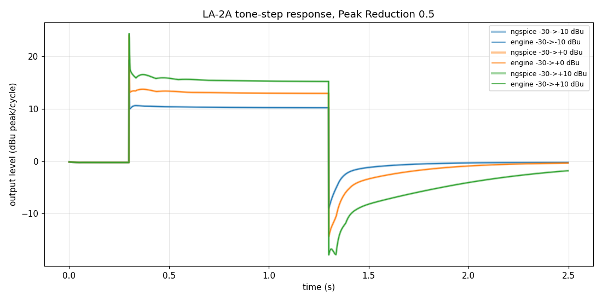

# LA-2A: ngspice spec vs the engine

`la2a.cir` is the reference: the whole LA-2A as a single ngspice circuit. It
uses Koren triode and pentode curves, Jiles-Atherton input and output
transformers, and a behavioural T4 cell. `core/circuit/circuits/LA2A.h` is the
engine's version of the same netlist.

The topology follows the Universal Audio LA-2A manual, figs. 5–7:
- **Attenuator:** R6 → j → R7 → T4 photocell, feeding the Gain pot.
- **Amplifier:** V1A/V1B 12AX7, then a V2 12BH7 White cathode follower.
- **Sidechain:** taken from j. Peak Reduction → V3 12AX7 cathode-coupled pair → V4 6AQ5 → EL panel.

Where the figures are silent or ambiguous, the choices are assumptions, listed
at the top of `LA2A.h`:
- the transformer ratios and cores;
- the V3 tail;
- the V4 screen feed;
- the EL panel's load;
- the feedback network, sized so the maximum gain is UA's 40 dB.

The T4 cell (`Devices.h` `T4Cell`) is fitted to UA's published figures:
- fast attack;
- about 60 ms to 50% release;
- 0.5–5 s to full release, depending on the history;
- up to 40 dB of reduction.

`build/t4_test` checks the cell against those figures; `t4_release.png` shows the result.

The engine solves the audio path and the sidechain as two circuits. They meet
only at j and at the T4. The deck solves the whole thing as one circuit, so
the comparison below also checks that split.

## Results

A 1 kHz tone steps from -30 dBu up to the level in the first column at 0.3 s,
then back down at 1.3 s. Peak Reduction is 50% and Gain is 30%. Each pair of
values is ngspice / engine.

| step | out at hold (dBu) | release to 1 dB (s) | envelope diff rms / max (dB) | waveform err |
|---|---|---|---|---|
| -30 → -10 | 10.22 / 10.22 | 0.19 / 0.19 | 0.00 / 0.03 | 3.4e-4 |
| -30 → 0 | 12.97 / 12.96 | 0.58 / 0.58 | 0.00 / 0.09 | 4.7e-4 |
| -30 → +10 | 15.25 / 15.25 | 1.20 / 1.20 | 0.00 / 0.05 | 3.1e-4 |

Running the sidechain at a quarter of the audio rate (`--every 4`, as Circuit
Bench does) stays within 0.2 dB. The bias matches ngspice to the last printed
digit.



Other measurements, from `build/la2a_test`:
- **Gain:** 40.2 dB at full Gain, flat from 30 Hz to 15 kHz within 0.2 dB.
- **Output:** clips at about +21 dBu.
- **Static curve:** the knee sits about 5 dB above the Peak Reduction threshold. Above it the ratio runs from about 3:1 up to limiting.
- **Cost:** 2.5–2.9x realtime mono at 192 kHz (4x oversampling of 48k).

## Running

```
cmake --build build --target la2a_render la2a_test
python3 sim/la2a/compare.py                                  # default cases (the output clips at Gain 75%)
python3 sim/la2a/compare.py --gain 0.3 --plot step_response.png
python3 sim/la2a/compare.py --every 4                        # quarter-rate sidechain
build/la2a_test [--peak 0..1] [--gain 0..1]                  # operating point, gain, static curve, cost
```

ngspice runs one at a time with `OMP_NUM_THREADS=1`; see `../tubepre/README.md`.
Each case takes about 25 s.
