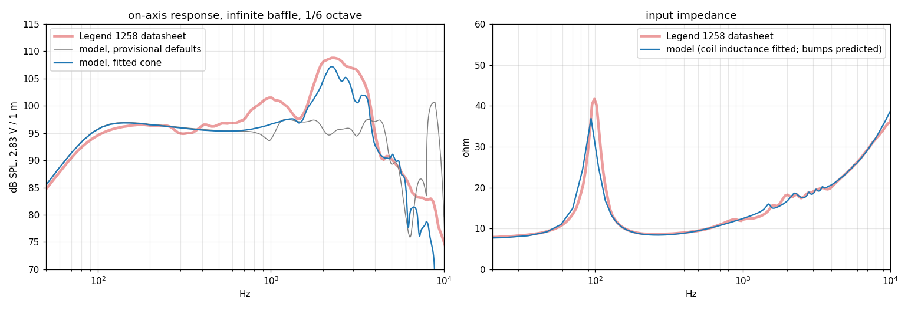

# Speaker cab: verification

The plan and alternatives are in `docs/briefs/2026-09-26-speaker-cab.md`. This
folder checks each piece of the "physics → IR" model against a reference.

| Piece | Code | Reference | Result |
|---|---|---|---|
| Driver + closed box (lumped, per sample) | `core/circuit/circuits/Speaker.h` | exact network formula; `speaker.cir` (ngspice); closed-box theory | ngspice within 1e-7 dB of the formula; fitted fc and Qtc equal theory (124.74 Hz, 0.708); engine within 0.0001 dB below 300 Hz and 0.11 dB at 5 kHz at 96 kHz (trapezoidal frequency warping). `compare.py` |
| Radiation to the mic (Rayleigh integral in the near field) | `core/acoustic/Radiation.h` | baffled-piston results: on-axis near field; far-field 2·J1(x)/x; the proximity effect 1 + 1/(jkr) | 0.15 dB on axis at 2.5 cm, 0.004 dB at 1 m; directivity within 0.05 dB; proximity within 0.01 dB at 20 cm; capsule averaging converges to the point mic. `radiation.py` |
| Cone breakup (axisymmetric shell FE) | `core/acoustic/Cone.h` | flat limit, bending: driven annular plate (exact Bessel); flat limit, in-plane: radially driven annulus (exact Bessel); rigid limit; mesh convergence | bending 0.04 dB; membrane 0.02 dB (same resonance, 5584 Hz); the rigid-limit error shrinks as 1/E; 96 elements within 0.05 dB of 384. `cone.py` |
| Back opening (open back) | `Speaker.h` (the air plug in parallel with the box air), `Coupling.h`, `CabModel.h` (the rear wave round the box) | the exact network and ngspice at 20–2000 cm^2; the Helmholtz formula | ngspice within 2.4e-6 dB of the formula, engine within 0.11 dB; a 20 cm^2 opening's impedance dip lands at 43.3 Hz against the formula's 44.2 Hz; closed (0 cm^2) is unchanged. The rear wave's diffraction round the box is approximate, and the front baffle's edge (baffle step) isn't modelled yet. `compare.py` (4) |
| Measured mic (dynamic cardioid) | `MicModels.h`, `Radiation.h` | the manufacturer's polar curves (125 Hz – 8 kHz) and on-axis response, extracted from the datasheet PDF's vector paths (`reference/mic/`) | polar pickup through the full model within 0.76 dB RMS (max 1.6 dB) at 30–120 deg; on-axis response within 0.35 dB. `radiation.py` (5) |
| Mic face reflection | `Radiation.h` (`micReflection`) | Kirchhoff disc reflection, one round trip mic face – cone/baffle | no reference data; about ±0.5–1 dB of comb for a 32 mm face 2.5 cm out |
| Cone load on the motor (`Coupling.h`) | `core/acoustic/Coupling.h` | independent calculation, rigid cone: the circuit's fixed mass vs the true air load (baffled-piston radiation impedance, exact Struve series) | 0.009 dB, 0.003 deg; exactly 1 at low frequency, so the verified circuit is untouched |

## Speaker size

The moving mass is built from its parts: the coil and former (a knob, 6.6 g for
the calibrated speaker), the paper, surround and dust cap (integrated from the
cone's geometry and material exactly as the shell model does), and the air
load. Sd follows the radius. So the speaker-size knob, and the paper knobs,
move the driver's mass, resonance and sensitivity consistently:

| Nominal size | Sd | Mms | Fs |
|---|---|---|---|
| 10" | 352 cm^2 | 23.9 g | 109 Hz |
| 12" | 507 cm^2 | 32 g | 94 Hz |
| 15" | 791 cm^2 | 49 g | 76 Hz |

The calibrated 12"'s cone and motor are rescaled, so a 10" here is not a
specific real 10" speaker.

## Calibration against a real speaker: Eminence Legend 1258

`calibrate.py`; the data and its sources are in `reference/`. The driver is
the datasheet's own Thiele-Small set. The chart is extracted from the PDF's
vector paths, not traced. Measured conditions: 2.83 V, 1 m, infinite baffle,
1/6 octave.

1. **Unfitted:** the lumped driver plus radiation lands within 0.6–1.9 dB of
   the published curve from 100 to 500 Hz. That's an independent check of the
   whole low end.
2. **Cone fitted, cut at coil velocity:** the fit needed paper five times
   stiffer per unit mass than real paper. That exposed a missing mechanism:
   above breakup the outer cone decouples and the air load fades, so the coil
   pushes less mass and moves faster.
3. **With the cone loading the motor (`Coupling.h`):** 12.5 dB RMS at the
   provisional defaults drops to 5.0 dB before any fitting, and the fit reaches
   1.1 dB RMS (80 Hz – 6 kHz) with realistic paper.
4. **Coil inductance fitted to the impedance curve** (Le 0.56 mH plus
   L2 0.98 mH ∥ R2 6.8 Ω, the standard lossy-coil model), **then the cone
   refitted:** SPL 2.2 dB RMS, impedance 0.67 dB RMS.
   - The breakup bumps on the impedance curve (1.5–3.5 kHz) and the resonance
     (94 vs 99 Hz) are predictions. Nothing was fitted to them.
   - Fitted cone: E 4.8 GPa, 441 kg/m^3, 0.30 mm at the edge tapering to 1.65×
     at the neck, loss 0.03, 6 cm deep, slightly curved, 0.7 g dust cap, cone
     mass 9.5 g. Some values sit at their bounds: very thin, very low loss, the
     full depth. So the model is still missing something.
   - The remaining misses: the 1 kHz bump (about 4 dB low), the main peak
     (1–2 dB low), and above 6 kHz, outside the fitted band.



**Next, the IR tuning loop:** fit the same model to real cab IRs with known mic
positions. That tests mic placement, not just on-axis response.

## Running

```
cmake --build build --target speaker_render radiation_check cone_check
python3 sim/speaker/compare.py --plot response.png      # driver + box
python3 sim/speaker/radiation.py --plot radiation.png   # radiation to the mic
python3 sim/speaker/cone.py --plot cone.png             # cone breakup
python3 sim/speaker/breakup.py --plot breakup.png [--eta 0.08 --sr 20 ...]   # the whole speaker
python3 sim/speaker/calibrate.py [--fit] [--electrical] --plot calibration.png   # fit to the Legend 1258
python3 sim/speaker/listen.py [out_dir] [--generic|--rigid] [--in di.wav]  # riff -> Phys Fuzz -> calibrated cab -> WAVs
```
